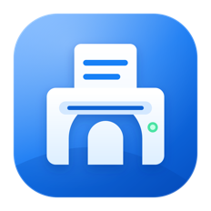

# Printer Bridge

<p align="center">
  
</p>

Printer Bridge enables AirPrint on older printers so you can print from an iPhone, iPad, or Mac. If a printer already works from your Mac, Printer Bridge can usually make it available to other Apple devices on the same local network.

Printer Bridge is free, open source, and built for macOS 15 or later. It supports both Apple Silicon and Intel Macs.

[Learn more](https://www.generouscorp.com/printer-bridge/)

## Download

For most people, the signed and notarized release is the best way to install Printer Bridge:

- [Download the latest DMG](https://github.com/danielraffel/printer-bridge/releases/latest/download/Printer-Bridge.dmg)
- [View all GitHub releases](https://github.com/danielraffel/printer-bridge/releases)

Open the DMG, run `Install Printer Bridge.pkg`, and then launch Printer Bridge from the Applications folder.

## Requirements

- macOS 15 or later
- An Apple Silicon or Intel Mac
- A printer that already prints successfully from that Mac
- The Mac and AirPrint device connected to the same local network
- The Mac awake while you want AirPrint to remain available

Printer Bridge does not normally require macOS Printer Sharing. It runs its own local AirPrint proxy and forwards jobs to the printer queue already configured on the Mac.

## Features

- Share existing macOS printer queues through AirPrint
- Print from iPhone, iPad, and Mac
- Choose supported paper sizes and media types, including plain and photo paper
- Enable one or more printers
- View recent jobs and queue activity
- Give printers cleaner AirPrint names
- Keep sharing active through a background service
- Use system, light, or dark appearance
- Keep printing local, with no cloud service, analytics, tracking, or advertising

## How it works

Printer Bridge advertises an AirPrint-compatible printer over Bonjour and accepts IPP print jobs through a local proxy. It then sends those jobs to CUPS, the printing system macOS already uses for the selected printer.

The app consists of:

- A SwiftUI configuration and queue-management app
- A Swift 6 core library for printer discovery, IPP handling, and job routing
- A per-user background agent managed by macOS Service Management
- A local AirPrint/IPP proxy advertised as `_ipp._tcp,_universal`

Printing stays on the Mac and local network.

## AirPrint options

Printer Bridge translates standard AirPrint job settings into the options exposed by the selected macOS printer driver. When the driver supports them, the iPhone or iPad print sheet can offer:

- Plain, coated, glossy, high-gloss, matte, semi-gloss, label, envelope, and letterhead media
- Draft, normal, and best print quality
- Color and monochrome printing
- Driver-supported document and photo sizes such as A4, 4 × 6, 5 × 7, 5 × 8, and 8 × 10 inches
- Bordered and borderless variants based on the margins requested by the printing app
- Copies, orientation, resolution, and fit/fill scaling

The available choices come from the installed driver, so they vary by printer. Photo apps commonly request a borderless size automatically; document apps normally request the bordered variant.

## Build from source

Building requires:

- Xcode with the macOS 15 SDK or later
- Swift 6
- [XcodeGen](https://github.com/yonaskolb/XcodeGen) 2.44 or later

Install XcodeGen with Homebrew, clone the repository, and run the build script:

```sh
brew install xcodegen
git clone https://github.com/danielraffel/printer-bridge.git
cd printer-bridge
./scripts/dev/build-macos.sh
```

The script builds and combines Apple Silicon and Intel slices. The universal app is written to:

```text
.build/dist/Printer Bridge.app
```

If a Developer ID Application certificate is available, the script uses it. Otherwise it applies an ad hoc signature suitable for local development. Use the notarized GitHub release for normal installation and reliable background-service operation.

Run the shared core tests with:

```sh
./scripts/dev/test-core.sh
```

To generate the Xcode project and work in Xcode:

```sh
./scripts/dev/generate-xcode-project.sh
open apps/macos/PrinterBridge.xcodeproj
```

The generated project provides these schemes:

- `PrinterBridge` — macOS app and background agent
- `PrinterBridgeDev` — app, background agent, and development CLI
- `PrinterBridgeCLI` — command-line diagnostics only

Build the standalone universal diagnostics CLI with:

```sh
./scripts/dev/build-cli.sh
```

## Repository layout

- `apps/macos/` — SwiftUI app, background agent, and development CLI
- `packages/core/` — shared Swift package and tests
- `scripts/dev/` — project generation, builds, and tests
- `scripts/release/` — signed PKG and DMG release tooling
- `scripts/validate/` — local AirPrint and printer diagnostics
- `docs/` — website, screenshots, and legal documents

## Support and contributing

- [Report a bug](https://github.com/danielraffel/printer-bridge/issues/new?template=bug_report.yml)
- [Request a feature](https://github.com/danielraffel/printer-bridge/issues/new?template=feature_request.yml)
- Pull requests are welcome

Printer Bridge is available under the [MIT License](LICENSE).

AirPrint, iPhone, iPad, Mac, and macOS are trademarks of Apple. Printer Bridge is not affiliated with Apple.
