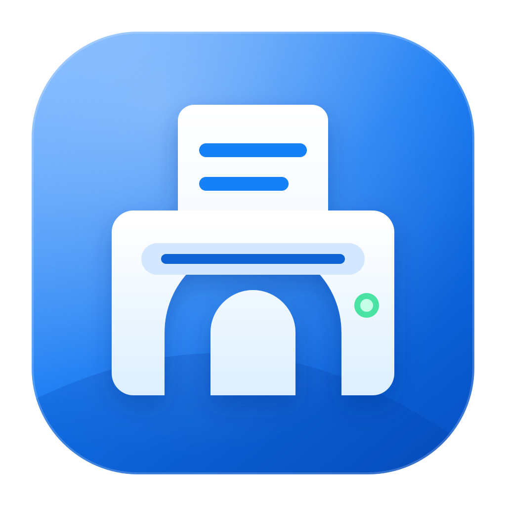
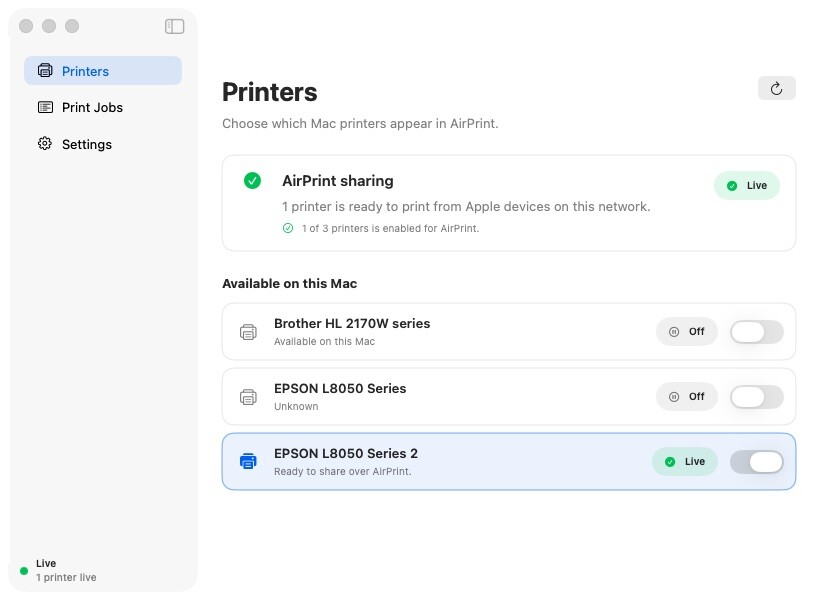
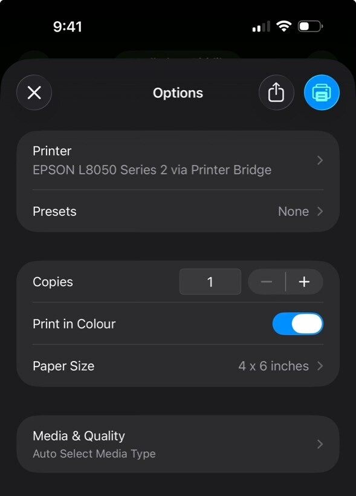

<p align="center">
  
</p>

<h1 align="center">Printer Bridge</h1>

<p align="center">
  <strong>Give the printers already connected to your Mac a modern AirPrint experience.</strong>
  <br>
  Print documents and high-quality photos from iPhone, iPad, or Mac—locally, privately, and without a cloud subscription.
</p>

<p align="center">
  
  
  
  <a href="LICENSE"></a>
</p>

<p align="center">
  <a href="#quick-start"><strong>Build and run</strong></a>
  ·
  <a href="https://github.com/danielraffel/printer-bridge/releases"><strong>Upstream releases</strong></a>
  ·
  <a href="#printing-options"><strong>Printing options</strong></a>
</p>

---

## Your Mac printer, now on iPhone

Printer Bridge discovers printer queues that already work on macOS, publishes them through Bonjour, and translates AirPrint jobs into the settings understood by the installed printer driver.

<table>
  <tr>
    <td width="68%" align="center">
      
    </td>
    <td width="32%" align="center">
      
    </td>
  </tr>
  <tr>
    <td align="center"><sub>Manage every local printer from a clear native macOS dashboard.</sub></td>
    <td align="center"><sub>Choose colour, paper size, media, and quality from the iPhone print sheet.</sub></td>
  </tr>
</table>

## Made for documents and photos

| Everyday printing | Photo printing |
| --- | --- |
| A4, Letter, envelopes, and driver-supported sizes | 4 × 6, 5 × 7, 5 × 8, 8 × 10, and driver-supported photo sizes |
| Colour or monochrome output | Glossy, matte, semi-gloss, and other photo media |
| Draft, normal, and best quality | High-quality driver modes and advertised resolutions |
| Portrait and landscape orientation | Bordered or borderless output when the driver supports it |
| Copies and page ranges | Fit or centre-fill scaling with orientation-aware cropping |

The media and quality choices shown on an Apple device come from the selected macOS printer driver. Printer Bridge converts standard IPP/AirPrint choices into the appropriate CUPS driver options. The extended photo workflow has been developed and tested with the **Epson L8050**.

## Highlights

- **Native AirPrint** — print from the standard share sheet in Photos, Safari, Files, Mail, and other Apple apps.
- **Multiple printers** — publish one or more macOS queues independently.
- **Real printer controls** — expose supported media sizes, media types, quality, colour mode, orientation, and resolution.
- **Better borderless photos** — remove symmetric PDF padding and centre-fill the requested sheet without stretching the image.
- **Queue visibility** — monitor active jobs, inspect recent jobs, and cancel or clear them from the app.
- **Background sharing** — keep printers available after closing the main window.
- **Local and private** — no account, cloud relay, analytics, tracking, or advertising.
- **Universal Mac app** — supports Apple Silicon and Intel on macOS 15 or later.

## Quick start

### Install a release

The signed and notarized upstream release is the simplest starting point:

1. [Download the latest DMG](https://github.com/danielraffel/printer-bridge/releases/latest/download/Printer-Bridge.dmg).
2. Open the DMG and run `Install Printer Bridge.pkg`.
3. Launch Printer Bridge from Applications.
4. Turn on AirPrint beside the printer you want to share.
5. On iPhone or iPad, open **Print**, choose the bridged printer, and select the paper and quality options you need.

> [!NOTE]
> The upstream release may not yet contain changes that exist on this fork's `main` branch. Build from source below to use the newest code in this repository.

### Build this version from source

You will need Xcode with the macOS 15 SDK, Swift 6, [XcodeGen](https://github.com/yonaskolb/XcodeGen) 2.44 or later, and `librsvg` for rendering the SVG app icon.

```sh
brew install xcodegen
brew install xcodegen librsvg
git clone https://github.com/harishvishwakarma/printer-bridge.git
cd printer-bridge
./scripts/dev/build-macos.sh
open ".build/dist/Printer Bridge.app"
```

The build script creates a signed universal app containing both Apple Silicon and Intel binaries. It uses a Developer ID certificate when one is available and otherwise falls back to ad hoc signing for local development.

## Printing options

When supported by the installed driver, Printer Bridge can advertise:

- Plain, coated, glossy, high-gloss, matte, semi-gloss, label, envelope, and letterhead media
- Draft, normal, and best print quality
- Colour and monochrome printing
- A4, US Letter, 4 × 6, 5 × 7, 5 × 8, 8 × 10, and additional driver-defined sizes
- Bordered and borderless media variants
- Copies, page range, orientation, resolution, and fit/fill scaling

Photo apps often request a borderless size automatically, while document apps normally request the bordered variant. An explicit **Fit** request is preserved; automatic or **Fill** photo jobs may be centre-filled to remove unwanted symmetric white padding.

## How it works

```text
iPhone / iPad / Mac
        │  AirPrint · IPP · Bonjour
        ▼
Printer Bridge on macOS
        │  validates and translates job settings
        ▼
macOS CUPS queue + installed printer driver
        │
        ▼
Your printer
```

The project contains:

- A native SwiftUI app for printers, jobs, and settings
- A Swift 6 core library for discovery, IPP handling, media capabilities, and job routing
- A per-user background agent managed by macOS Service Management
- A local AirPrint proxy advertised as `_ipp._tcp,_universal`

Printer Bridge does not normally require macOS Printer Sharing. The Mac must be awake, and the Apple device must be able to reach it on the local network. AirPrint discovery is local-network-first; remote printing requires a network or VPN setup that carries both IP traffic and Bonjour/mDNS discovery.

## Development

Run all shared core tests:

```sh
./scripts/dev/test-core.sh
```

Generate and open the Xcode project:

```sh
./scripts/dev/generate-xcode-project.sh
open apps/macos/PrinterBridge.xcodeproj
```

Build the universal diagnostics CLI:

```sh
./scripts/dev/build-cli.sh
```

| Path | Purpose |
| --- | --- |
| `apps/macos/` | SwiftUI app, background agent, and diagnostics CLI |
| `packages/core/` | Shared printing, IPP, Bonjour, CUPS, and media logic |
| `scripts/dev/` | Project generation, local builds, and tests |
| `scripts/release/` | Signed package and DMG release tooling |
| `scripts/validate/` | Local printer and AirPrint diagnostics |
| `docs/` | Website, screenshots, research, and legal pages |

## Privacy and security

Print jobs travel between the Apple device, the Mac, and the configured printer. Printer Bridge does not upload documents, require an account, or add analytics. Review network and printer access as you would for any local print server, especially on shared or untrusted networks.

## Contributing

Issues and pull requests are welcome. If you are reporting a printer-specific problem, include the macOS version, printer model, installed driver, selected media and quality settings, and whether the same job prints correctly from a native Mac application.

- [Report an issue](https://github.com/harishvishwakarma/printer-bridge/issues)
- [View the upstream project](https://github.com/danielraffel/printer-bridge)
- [Read the MIT License](LICENSE)

<p align="center">
  <sub>AirPrint, iPhone, iPad, Mac, and macOS are trademarks of Apple. Printer Bridge is not affiliated with Apple.</sub>
</p>
